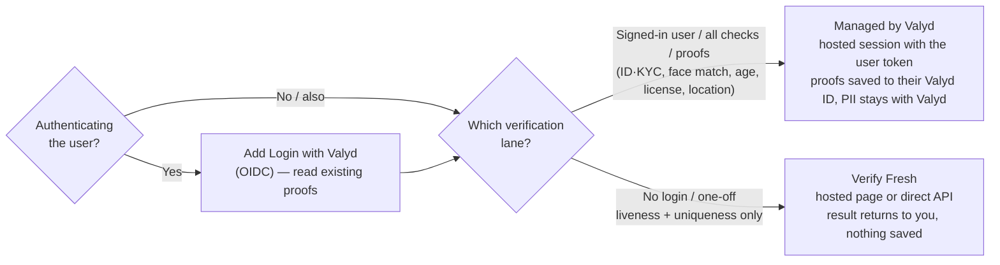

# Choose your integration

Login and verification are separate choices — not competing products. Answer these two questions
and you know exactly which docs to follow:

1. **Are you authenticating the user?** Yes → add **Login with Valyd** (OIDC), then read the proofs
   their account already holds. No sign-in needed → verification only.
2. **Which verification lane?**
   - **Signing the user in, want proofs saved to their account, or need ID/KYC, face match, age,
     professional license, or location?** → **Managed by Valyd**. The user signs in; you run a
     hosted session with their `valyd_access_token`; every check is available; passed proofs save
     to their Valyd ID and the raw identity data stays encrypted with Valyd.
   - **One-off, no login, only need liveness / uniqueness?** → **Verify Fresh**. No account,
     liveness + face-uniqueness + anti-spoof only, on Valyd's hosted page **or** as direct API
     calls; the result returns to you and nothing is saved to a Valyd account.

[Managed by Valyd](/verifications/managed) · [Verify Fresh](/verifications/standalone) · [Login with Valyd](/docs)

## Comparison

**Verify Fresh** is called the *standalone* API in the routes and API field names.

| | Managed by Valyd | Verify Fresh | Login with Valyd |
| --- | --- | --- | --- |
| Verifies someone? | Yes — any check, in one hosted session | Yes — liveness / uniqueness / anti-spoof only | No — reads proofs already on the account |
| Which checks | ID/KYC, liveness, face match, age, professional license, face uniqueness, location | Liveness, anti-spoof, face uniqueness | None — reads `id_verified`, age bands, license badges |
| End-user login | Required — the user signs in with Valyd | None — non-account | Required — it *is* OIDC |
| Hosted UI by Valyd | Yes (capture page) | Yes (capture page) — or call the API directly | Yes (the sign-in screen) |
| You build custom UI | Redirect only | Yes, fully (direct API) or redirect | Just a button |
| The user's Valyd ID | Passed proofs save to their Valyd ID; PII stays with Valyd | Not involved — nothing saved | Where the proofs are read from |
| Credential | `X-API-Key` + `workflow_id` + the user's `valyd_access_token` | `X-API-Key` | `client_id` + `client_secret` |
| Result arrives via | Signed webhook + decision endpoint — **proofs only** | Signed webhook (hosted) or synchronous JSON (direct) — returned to you | Bearer token → Account API |
| Best for | KYC / ID, licensed-professional checks, EVV presence, reusable proofs | One-off liveness, anti-spoof, duplicate-account (sybil) detection | Sign-in, reading reusable proofs |

> **ID/KYC, face match, age, professional license, and location run only through Managed by Valyd.**
> They are no longer self-serve direct calls — they require a signed-in user's hosted session, so the
> raw identity data stays encrypted with Valyd and you receive the decision plus reusable proofs.
> [Verify Fresh](/verifications/standalone) covers liveness, anti-spoof, and face uniqueness only.

## Start here

- **Managed by Valyd** → [Managed by Valyd](/verifications/managed) · [Hosted delivery](/verifications/hosted) · [Quickstart](/verifications/quickstart)
- **Verify Fresh** → [Verify Fresh checks](/verifications/standalone)
- **Login with Valyd** → [Add the button](/docs) · [Quickstart](/docs/quickstart/node)

> OIDC does not run a verification check — it signs the user in. Managed by Valyd runs the checks
> for that signed-in user; the user's token ([Managed by Valyd](/verifications/managed)) connects
> the two.
