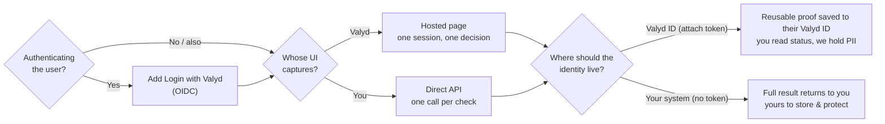

# Choose your integration

Login, verification **delivery**, and **data ownership** are three separate choices — not three
competing products. Answer these three questions and you know exactly which docs to follow:

1. **Are you authenticating the user?** Yes → add **Login with Valyd** (OIDC). No → verification only.
2. **Whose UI captures the documents / selfie?** Valyd's → **Hosted**. Yours → **Direct API**.
3. **Where should the verified identity live?** On the user's Valyd ID (attach their token → reusable
   proof, Valyd holds the PII) → **account-connected**. In your system (no token → full result returns
   to you, you own the data) → **one-off**.

[Login with Valyd](/docs) · [Hosted](/verifications/hosted) · [Direct API](/verifications/standalone) · [Verify & save a proof](/verifications/managed)

## Comparison

The **Direct API** is called the *standalone* API in the routes and API field names.

| | Hosted verification | Direct API | Login with Valyd |
| --- | --- | --- | --- |
| Verifies someone? | Yes — all workflow checks in one session | Yes — one check per call | No — reads proofs already on the account |
| Hosted UI by Valyd | Yes (capture page) | No | Yes (the sign-in screen) |
| You build custom UI | Redirect only | Yes, fully | Just a button |
| The user's Valyd ID | Carries the proof when their token rides along | Carries the proof when their token rides along | Where the proofs are read from |
| OIDC | Optional — sign the user in to save their proof | Optional — sign the user in to save their proof | Required — it *is* OIDC |
| Credential | `X-API-Key` + `workflow_id` | `X-API-Key` | `client_id` + `client_secret` |
| Result arrives via | Signed webhook + decision endpoint | Synchronous JSON response | Bearer token → Account API |
| Best for | KYC / ID + selfie capture, bundled checks | License lookup, backoffice, batch, custom UI | Sign-in, reading reusable proofs |

> **ID / KYC is the one exception to "your UI."** Establishing `id_verified` on a user's *account*
> is hosted-only (redirect via `verify.kyc.redirectUrl()`). Running ID/KYC on data **you** supply,
> with the result returned to you, is a normal [Direct API](/verifications/standalone) call.

## Start here

- **Hosted verification** → [Hosted delivery](/verifications/hosted) · [Quickstart](/verifications/quickstart)
- **Direct API on your own data** → [Direct API checks](/verifications/standalone)
- **Login with Valyd** → [Add the button](/docs) · [Quickstart](/docs/quickstart/node)
- **Run a check for a signed-in user** → [Verify & save a proof](/verifications/managed)

> OIDC does not run a verification check — it signs the user in. The Verification API runs the
> check. The user's token ([Verify & save a proof](/verifications/managed)) connects the two.
