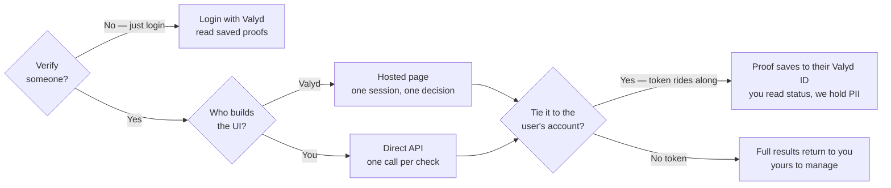

# Choose your integration

Three integrations, one decision tree. Answer two questions and you know exactly which docs to
follow.

[Login with Valyd](/docs) · [Hosted](/verifications/hosted) · [Direct API](/verifications/standalone) · [Verify the user](/verifications/managed)

## Comparison

| | Hosted verification | Standalone checks | Login with Valyd |
| --- | --- | --- | --- |
| Verifies someone? | Yes — all workflow checks in one session | Yes — one check per call | No — reads proofs already on the account |
| Hosted UI by Valyd | Yes (capture page) | No | Yes (the sign-in screen) |
| You build custom UI | Redirect only | Yes, fully | Just a button |
| The user's Valyd ID | Carries the proof when their token rides along | Carries the proof when their token rides along | Where the proofs are read from |
| OIDC | Optional — sign the user in to save their proof | Optional — sign the user in to save their proof | Required — it *is* OIDC |
| Credential | `X-API-Key` + `workflow_id` | `X-API-Key` | `client_id` + `client_secret` |
| Result arrives via | Signed webhook + decision endpoint | Synchronous JSON response | Bearer token → Account API |
| Best for | KYC / ID + selfie capture, bundled checks | License lookup, backoffice, batch, custom UI | Sign-in, reading reusable proofs |

## Start here

- **Hosted verification** → [Hosted delivery](/verifications/hosted) · [Quickstart](/verifications/quickstart)
- **Standalone checks on your own data** → [Standalone checks](/verifications/standalone)
- **Login with Valyd** → [Add the button](/docs) · [Complete example](/docs/quickstart/node)
- **Run a check for a signed-in user** → [Verify the user](/verifications/managed)

> OIDC does not run a verification check — it signs the user in. The Verification API runs the
> check. The user's token ([Verify the user](/verifications/managed)) connects the two.
