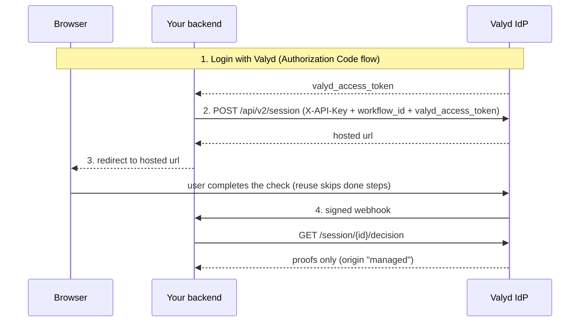
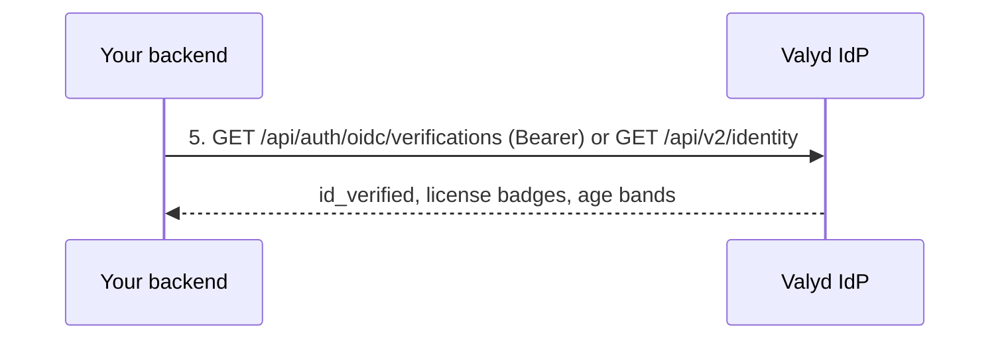

# Account-connected verification flow

> 🔑 **Auth:** App API key + the user's `valyd_access_token` · 👤 **User login:** required first · 💾 **Result:** proof saves to the user's Valyd account — read it back forever

The account-connected flow chains two things you already have: **Login with Valyd** gives your
backend a user access token, and the **Verification API** runs a check *with that token attached*.
A passed check becomes a durable **proof** on the user's Valyd account (pseudonym, `id_verified`,
license badges, age bands) — next time you just read it instead of re-running the check.

## When to use it

- The verified identity should belong to the **user's account**, reusable across sessions and
  apps — not a one-off result stored in your database.
- Returning users should re-verify with a **selfie only** (matched against their stored face
  vector) instead of redoing full KYC.
- You want proofs, not raw PII, in your system. Account APIs return proofs only — raw KYC is
  released solely via the user-approved [consent flow](/docs/request-data).

If nobody logs in and you just need a one-shot result in your own backend, use the
[hosted verification flow](/docs/flows/hosted-verification) without a user token.

## How it works

Then, any later day, your backend reads the saved proof without re-running anything:

## Steps

1. **Sign the user in** with the [Authorization Code flow](/docs/flows/authorization-code) —
   your backend ends up holding their `valyd_access_token`.
2. **Create the session with the token attached**: `POST /api/v2/session` with your App API key,
   a `workflow_id`, and the user's `valyd_access_token`. Already-verified steps are skipped on
   the hosted page.
3. **The user completes the check**; the passed result saves to their account as a proof.
4. **Read the outcome** via the signed webhook / decision endpoint (proofs only,
   `origin: "managed"`).
5. **Later reads are free of re-verification**: `GET /api/auth/oidc/verifications` (user Bearer
   token) or `GET /api/v2/identity?valyd_id=…` (API key). The `identity` object carries
   `verified_at` so you can judge freshness against your own policy.

## Security notes

- Account APIs **never** return raw KYC (DOB, document images) — proofs only. Raw attributes
  require the explicit, end-to-end-encrypted [consent flow](/docs/request-data).
- Both credentials stay server-side: the API key is not an OIDC token and must never be in a
  browser; the user token is short-lived (~15 min) — [refresh it](/docs/flows/refresh) as needed.
- A check never touches an account unless you attach the user's token; the Account API never
  runs a check. See [Data & trust](/docs/data-and-trust).

## Build it

- **Full guide (steps, Core APIs, consent):** [Account-connected verification](/verifications/managed)
- The login half: [Authorization Code flow](/docs/flows/authorization-code)
- The session half: [Hosted verification](/verifications/hosted)
- Reading proofs after login: [API reference — Resource API](/docs/endpoints#resource-api--user-data)
