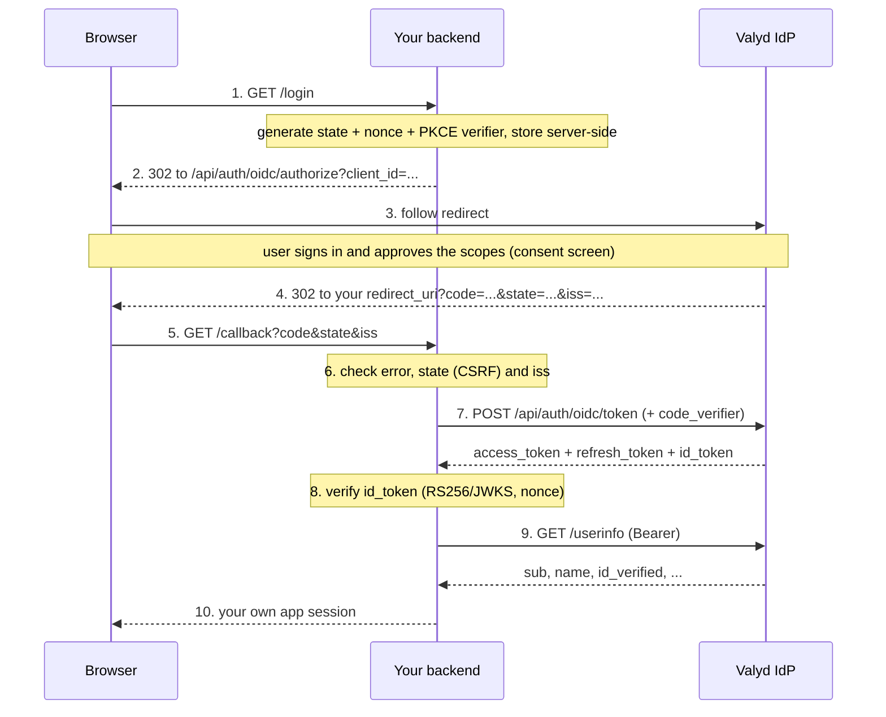

# Authorization Code flow

> 🔑 **Auth:** `client_id` + `client_secret` (server-side) · 👤 **This IS the login** — standard OpenID Connect · 📖 **Result:** tokens on your backend, user profile via UserInfo

The Authorization Code flow is the main way an app logs a user in with Valyd. The browser only
ever carries a one-time `code`; your backend exchanges it for tokens using your `client_secret`,
so no token ever touches the front end.

## When to use it

- Any app with a backend (web app, SSR site, mobile app with a server) that wants **Connect with
  Valyd**.
- You want the user's profile, `id_verified` status, licenses, or verification proofs after login.
- You're using the [drop-in button](/docs/flows/button), the `@valyd/sdk`, or
  [your own OIDC library](/docs/oidc) — all of them run this exact flow underneath.

Don't use it for the [Unique Human API](/verifications/unique-human) — those API-key calls answer
"is this a live, unique human?" with no user login involved at all.

## How it works

## Steps

1. **Start the flow.** Your login route generates a random `state` + `nonce` and a PKCE
   `code_verifier`, stores them server-side, and redirects the browser to
   `https://idp.valyd.work/api/auth/oidc/authorize` with `client_id`, `redirect_uri`,
   `response_type=code`, `scope` (must include `openid`), `state`, `nonce`,
   `code_challenge=BASE64URL(SHA256(code_verifier))`, and `code_challenge_method=S256`.
   **PKCE is required for every client, including confidential ones** (`plain` is not supported).
   `state` and `nonce` are optional but strongly recommended. The endpoint accepts GET or a POSTed
   form. With the SDK this is `valyd.auth.createAuthorizationRequest({ scope: [...] })`.
2. **User authenticates and consents.** Valyd shows the consent screen with the requested
   scopes; on approval it issues a one-time authorization `code`.
3. **Callback.** Valyd redirects the browser to your registered `redirect_uri` with
   `?code=…&state=…&iss=https://idp.valyd.work`. The `state` is echoed back unchanged (only if you
   sent one). If anything went wrong — the user pressed **Cancel**, `prompt=none` could not be
   satisfied, a required parameter was missing — you get
   `?error=…&error_description=…&state=…&iss=…` instead of a `code` (see
   [Authorization errors](/docs/errors#oidc-protocol-errors)). Only an unknown `client_id` or an
   unregistered `redirect_uri` shows an error page on Valyd instead of redirecting.
4. **CSRF + mix-up check.** Handle `error` first. Then compare the callback `state` strictly
   against the value you stored and check `iss` equals `https://idp.valyd.work` (RFC 9207).
   Reject with HTTP 400 on any mismatch, before touching the code.
5. **Exchange the code (server-side).** `POST https://idp.valyd.work/api/auth/oidc/token` with
   `grant_type: "authorization_code"`, your client credentials (`client_secret_basic` **or**
   `client_secret_post` — not both), the `code`, the **same** `redirect_uri`, and the
   `code_verifier`. The response is a top-level token JSON: `access_token`, `refresh_token`,
   `id_token`, `expires_in` (≈ 900), `scope`, `token_type`. Errors are standard OAuth 2.0 bodies:
   `{ "error": "invalid_grant", "error_description": "…" }`.
6. **Validate the ID token.** Verify the RS256 signature against the JWKS at
   `https://idp.valyd.work/api/auth/oidc/jwks.json`, and check `iss`, `aud` (= your
   `client_id`), `exp`, and — if you sent one — that `nonce` equals your value. `auth_time` is
   the time of the user's last real sign-in. The SDK's `handleCallback()` does steps 4–6 in one
   call.
7. **Fetch the user.** `GET https://idp.valyd.work/api/auth/oidc/userinfo` with
   `Authorization: Bearer <access_token>` returns `sub` (stable `valyd_…` id),
   `preferred_username`, `name`, `id_verified`, and more per the granted scopes. Set your own
   app session and you're done.

## Security notes

- **Codes are single-use, short-lived, and client-bound** — exchange immediately; a replay
  returns `invalid_grant` **and revokes every token that code already produced** (RFC 6749 §4.1.2).
- **PKCE binds the code to your login request** — a stolen code is useless without the
  `code_verifier`.
- **Check `iss` on the callback** to defend against authorization-server mix-up attacks.
- **Force or skip interaction with `prompt` / `max_age`.** `prompt=none` checks silently
  (`login_required` / `consent_required` come back as errors); `prompt=login` or `max_age=N`
  forces a fresh sign-in; `prompt=consent` always shows the consent screen.
- **The `state` comparison is your CSRF protection.** Never skip it.
- **The `nonce` check is your replay protection** for the ID token.
- **`client_secret` and tokens live on your backend only** — the exchange must never run in the
  browser.
- Access tokens last ~15 minutes; use the [refresh flow](/docs/flows/refresh) to renew.
  Refresh tokens rotate on every use.
- The `redirect_uri` must exactly match a registered redirect URI — scheme, host, and path.

## Build it

- Drop-in front end: the [Sign-in button flow](/docs/flows/button)
- Full raw-HTTP walkthrough with SDK + Python/PHP/Java examples: [Authentication](/docs/authentication)
- Complete Express example: [Node.js quickstart](/docs/quickstart/node)
- Bring your own library via discovery: [Use any OIDC library](/docs/oidc)
- What's inside each token: [Tokens](/docs/tokens)
