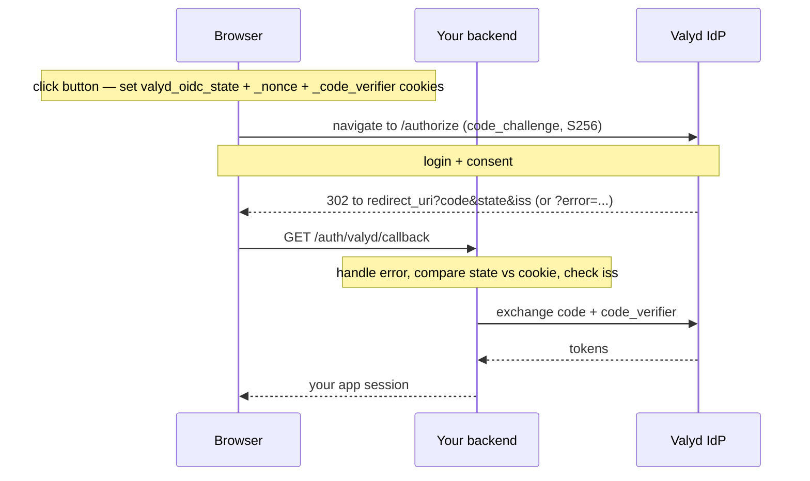

# Sign-in button flow

> 🔑 **Auth:** `client_id` in the tag, `client_secret` stays on your backend · 👤 **This IS the login** — the button runs the Authorization Code flow for you

The drop-in button (`https://idp.valyd.work/signin/client.js`) is a front end for the
[Authorization Code flow](/docs/flows/authorization-code). It generates `state`, `nonce`, and a
PKCE `code_verifier` (PKCE S256 is required for every client), builds the authorize URL, and redirects the user to Valyd. The code exchange still happens on
your backend with your `client_secret`.

```html
<script src="https://idp.valyd.work/signin/client.js" async></script>
<div class="valyd-signin"
     data-client-id="YOUR_CLIENT_ID"
     data-redirect-uri="https://yourapp.com/auth/valyd/callback"
     data-scope="profile verifications"></div>
```

## Redirect mode

Before redirecting, the button stores the generated values in `valyd_oidc_state`,
`valyd_oidc_nonce`, and `valyd_oidc_code_verifier` cookies (first-party, `SameSite=Lax`, 10 min)
so your callback route can compare them and send the verifier at the code exchange.



Backend handler (the whole thing):

```typescript
app.get("/auth/valyd/callback", async (req, res) => {
  try {
    const { user } = await valyd.handleCallback(req.url, {
      expectedState: req.cookies.valyd_oidc_state,          // the button set these cookies
      nonce: req.cookies.valyd_oidc_nonce,
      codeVerifier: req.cookies.valyd_oidc_code_verifier,   // PKCE
    });
    res.redirect("/dashboard");
  } catch (err) {
    // e.g. access_denied (user pressed Cancel), invalid_grant, issuer_mismatch
    res.status(400).send(err.code);
  }
});
```

## Security notes

- Your backend owns the code exchange, ID-token validation (RS256/JWKS, `nonce`,
  `aud` = your `client_id`), and session creation. Never accept tokens minted anywhere but your
  own backend.
- Codes are single-use and expire fast — send them to your backend immediately.
- The cookie comparison **is** the CSRF check; if cookies are being blocked
  (third-party contexts, `SameSite`), legitimate logins fail with `state mismatch` — see
  [Errors](/docs/errors).
- `client_secret` never appears in the page.

## Build it

- The flow underneath: [Authorization Code flow](/docs/flows/authorization-code)
- Button + callback walkthrough: [Connect with Valyd](/docs)
- Full working app: [Node.js quickstart](/docs/quickstart/node)
- What comes back in the tokens: [Tokens](/docs/tokens)
