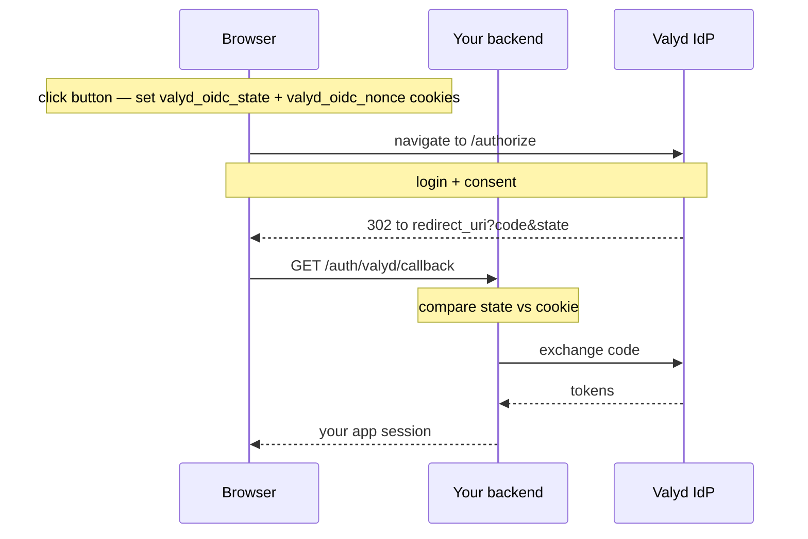
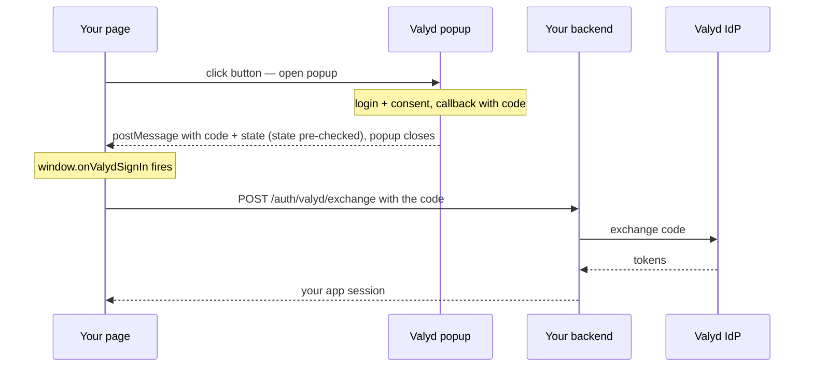

# Sign-in button flow

> 🔑 **Auth:** `client_id` in the tag, `client_secret` stays on your backend · 👤 **This IS the login** — the button runs the Authorization Code flow for you

The drop-in button (`https://idp.valyd.work/signin/client.js`) is a front end for the
[Authorization Code flow](/docs/flows/authorization-code). It generates `state` and `nonce`,
builds the authorize URL, and hands the result to your backend. It has two delivery modes:
**redirect** (default) and **popup**.

```html
<script src="https://idp.valyd.work/signin/client.js" async></script>
<div class="valyd-signin"
     data-client-id="YOUR_CLIENT_ID"
     data-redirect-uri="https://yourapp.com/auth/valyd/callback"
     data-scope="profile verifications"></div>
```

## When to use which mode

| | Redirect mode | Popup mode |
| --- | --- | --- |
| Feel | Full-page navigation to Valyd and back | Your page stays put; login happens in a popup |
| Best for | Classic server-rendered apps, simplest setup | SPAs and pages with state you don't want to lose |
| Code delivery | Browser lands on your callback route | `postMessage` → your JS → your backend |
| State check | Your backend compares the cookie | Pre-checked by the button before handoff |

Either way, the **code exchange still happens on your backend** with your `client_secret`.

## Redirect mode

Before redirecting, the button stores the generated values in `valyd_oidc_state` and
`valyd_oidc_nonce` cookies so your callback route can compare them.



Backend handler (the whole thing):

```typescript
app.get("/auth/valyd/callback", async (req, res) => {
  const { user } = await valyd.handleCallback(req.url, {
    expectedState: req.cookies.valyd_oidc_state,   // the button set this cookie
    nonce: req.cookies.valyd_oidc_nonce,
  });
  res.redirect("/dashboard");
});
```

## Popup mode

The button opens the Valyd login in a popup window. When the user finishes, the popup delivers
`{ code, state }` back to your page via `postMessage` — with the `state` already checked against
the value the button generated — and calls your `window.onValydSignIn` handler. Your JS then
POSTs the code to your backend for the exchange.



```javascript
window.onValydSignIn = async ({ code }) => {
  // state was already verified by the button before this fires
  const res = await fetch("/auth/valyd/exchange", {
    method: "POST",
    headers: { "Content-Type": "application/json" },
    body: JSON.stringify({ code }),
  });
  if (res.ok) location.assign("/dashboard");
};
```

Your `/auth/valyd/exchange` route exchanges the code exactly like a redirect callback
(`valyd.auth.exchangeCode(code)` with `@valyd/sdk@^1.10.2`), then verifies the ID token and sets
your session.

## Security notes

- The popup's `state` pre-check protects the browser handoff, but your backend still owns the
  code exchange, ID-token validation (RS256/JWKS, `nonce`, `aud` = your `client_id`), and
  session creation. Never accept tokens minted anywhere but your own backend.
- Codes are single-use and expire fast — send them to your backend immediately.
- In redirect mode, the cookie comparison **is** the CSRF check; if cookies are being blocked
  (third-party contexts, `SameSite`), legitimate logins fail with `state mismatch` — see
  [Errors](/docs/errors).
- `client_secret` never appears in the page in either mode.

## Build it

- The flow underneath: [Authorization Code flow](/docs/flows/authorization-code)
- Button + callback walkthrough: [Login with Valyd](/docs)
- Full working app: [Complete example](/docs/quick-start)
- What comes back in the tokens: [Tokens](/docs/tokens)
