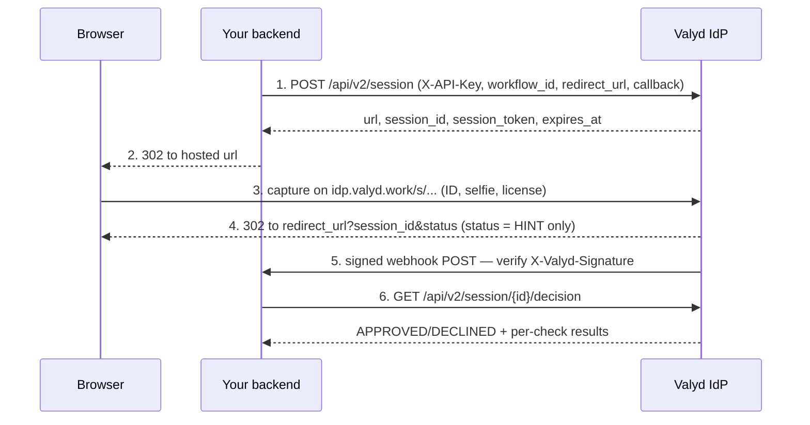

# Hosted verification flow

> 🔑 **Auth:** App API key (`X-API-Key`) + workflow · 👤 **User login:** not required · 🔗 **Account attach:** optional — add `valyd_access_token`

Hosted verification runs a KYC or license check with **no user login and no UI to build**: your
backend creates a session, you send the person to Valyd's capture page, and the result comes back
as a signed webhook plus an authoritative decision API. The decision belongs to your integration —
nothing is saved to a Valyd account unless you attach a user token.

## When to use it

- One-shot identity or license checks where the person doesn't have (or doesn't need) a Valyd
  login — onboarding forms, gig-worker screening, license validation.
- You want Valyd to own the capture UX (camera, retries, anti-spoofing) end to end.
- The result should live in **your** system. If it should save to the user's Valyd account
  instead, use the [account-connected flow](/docs/flows/account-connected).

## How it works

## Steps

1. **Create a session (server-side)**: `POST https://idp.valyd.work/api/v2/session` with your
   `X-API-Key`, a `workflow_id`, your `redirect_url` and webhook `callback`, and `vendor_data`
   (your internal user ref, echoed back on the webhook).
2. **Redirect the browser** to the returned hosted `url`; the capture steps auto-adapt to the
   workflow's checks. Status moves `NOT_STARTED → IN_PROGRESS → …`.
3. **Handle the return** to `redirect_url?session_id=…&status=…` — the `status` param is a
   **hint only**; show a pending page.
4. **Receive the signed webhook** on a terminal status (`APPROVED`, `DECLINED`, `ABANDONED`,
   `EXPIRED`), then **fetch the authoritative decision**:
   `GET /api/v2/session/{session_id}/decision` for the full per-check breakdown.

## Security notes

- Keep `X-API-Key` server-side only — the browser sees only the hosted `url`/`session_token`.
- Verify webhooks against the **raw** body (HMAC-SHA256, `X-Valyd-Signature`) and reject stale
  timestamps; dedupe on `X-Valyd-Event-Id`.
- Never treat the redirect `?status=` as final — only the webhook/decision API is authoritative.
- Raw KYC fields in a decision are released only after the required ID, liveness, and
  face-match gates pass; sessions that expire or are abandoned are never resumed — create a new
  one.

## Build it

- **Full guide (SDK code, webhooks, decision reading, statuses):** [Hosted verification](/verifications/hosted)
- Save results to the user's account instead: [Account-connected flow](/docs/flows/account-connected)
- Pick the checks a session runs: [Workflows](/verifications/workflows)
- What each status means: [Decisions & statuses](/verifications/statuses)
