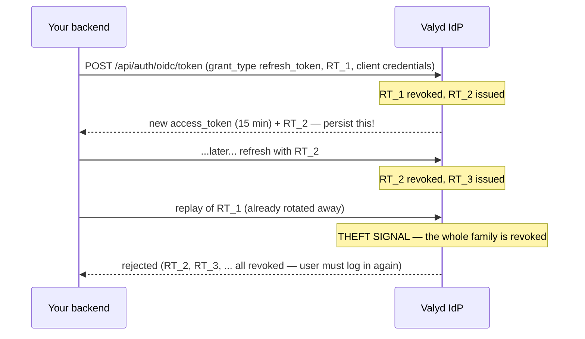

# Refresh & logout flow

> 🔑 **Auth:** `client_id` + `client_secret` + `refresh_token` (backend only) · 🔁 **Rotation:** every refresh returns a NEW refresh token · 🚪 **Logout:** RP-initiated via `end_session_endpoint`

Access tokens live ~15 minutes (`expires_in` ≈ 900). The refresh grant renews them from your
backend without bothering the user — for up to 30 days per refresh-token family.

## How it works



## Steps

1. `POST https://idp.valyd.work/api/auth/oidc/token` with
   `{ "grant_type": "refresh_token", "refresh_token": "…", "client_id": "…", "client_secret": "…" }`.
2. Read the top-level response: a fresh `access_token` **and a new `refresh_token`**.
3. **Persist the new refresh token, atomically replacing the old one.** With the SDK
   (`@valyd/sdk@^1.10.2`): `const next = await valyd.auth.refreshToken(stored)` — store both
   `next.accessToken` and `next.refreshToken`.

## Rotation & theft detection

- **Rotation is on for every refresh**: the token you sent is revoked the moment the new one is
  issued. A "refresh token" is therefore a chain, not a value — always save the latest link.
- **Replaying a rotated-away token is treated as theft** and revokes *every* refresh token for
  that user and client. That's a feature: if a token is stolen, either the thief or the real
  client eventually replays a stale one, and the whole family dies instead of living for 30 days.
- Refresh tokens are client-bound — a token leaked from one app cannot be used by another.
- Practical consequences: don't refresh the same stored token from two processes concurrently,
  and if your persist step can fail, treat "refresh succeeded but save failed" as a forced
  re-login.

## Logout & revocation

RP-initiated logout is `GET https://idp.valyd.work/api/auth/oidc/logout`, advertised in
discovery as `end_session_endpoint`:

```text
https://idp.valyd.work/api/auth/oidc/logout?id_token_hint=ID_TOKEN&post_logout_redirect_uri=https://yourapp.com/logged-out&state=RANDOM
```

- `id_token_hint` — the `id_token` from login; an **expired one is accepted** (its signature
  still proves the user/client).
- `post_logout_redirect_uri` — must **exactly match** one of your registered redirect URIs, so
  register your post-logout URL as an additional redirect URI.
- `state` — optional, echoed back.

It revokes the user's refresh and access tokens **for your client**, then redirects. Also clear
your own app session — Valyd can't do that for you.

## Build it

- Where the first refresh token comes from: [Authorization Code flow](/docs/flows/authorization-code)
- Token/logout endpoint details: [API reference](/docs/endpoints#post-apiauthoidctoken--token-exchange--refresh)
- Lifetimes and claims: [Tokens](/docs/tokens)
- Login session vs verification session: [Sessions](/docs/sessions)
