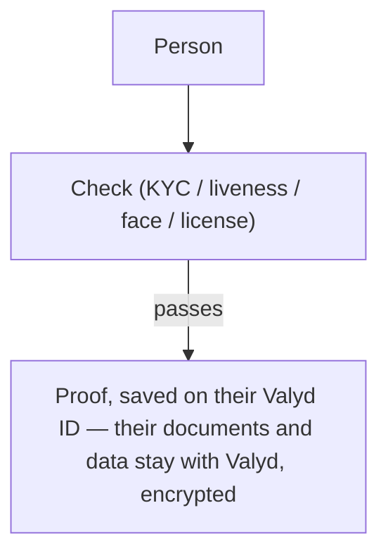
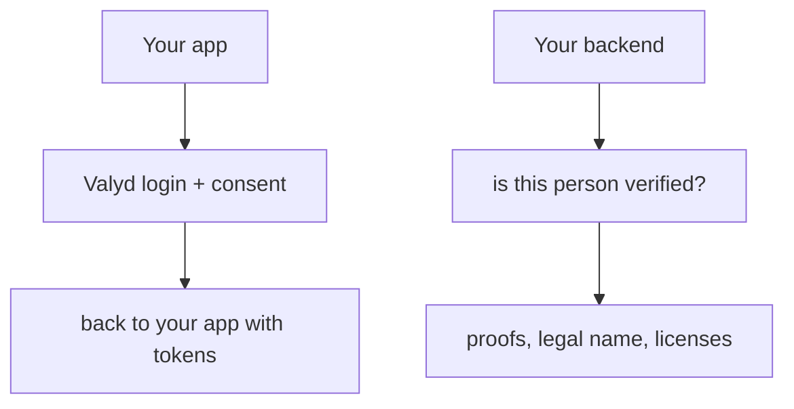
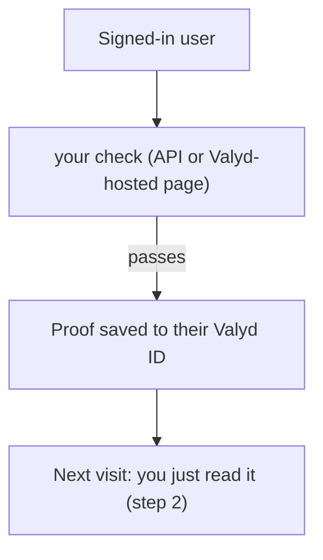

# How Valyd works

You've never used Valyd or OIDC before? This page is the whole mental model, in three pictures.

## 1. A person verifies once

Somewhere — in your app, or any app using Valyd — a person proves who they are: they scan their
ID, pass a liveness check, match their face, or have a professional license looked up. Valyd runs
that check for real (there are no simulated results) and, when the person has a Valyd account,
the passed outcome is saved to it as a **proof**.

## 2. They sign in to your app

"Sign in with Valyd" is a standard login button (like "Sign in with Google"). The person
authenticates with their verified identity — face, not passwords — and approves what your app
may read (the [scopes](/docs/scopes)). Your backend gets tokens.

You never see their documents — you read the **answers**: `id_verified: true`, verified
licenses, age bands.

## 3. Need a new check? Attach it to the account

If the account doesn't hold the proof you need yet, run the check yourself — with the signed-in
user's token attached, so the result saves back to their account:

That's the loop: **verify once → sign in anywhere → read the proof — and only re-verify when
your policy wants a fresher answer.**

Prefer to keep results in your own system instead? Every check also runs with
[just an API key](/verifications/quickstart) — no login — and then storing and protecting the
person's data is your responsibility.

## What the verification APIs let you build

The checks aren't just onboarding KYC — you run them **whenever** you need fresh proof, tied to
the signed-in person:

- **Prove it's really them, right now** — a [face match](/docs/user-token/face-match) against
  their enrolled face before a sensitive action (a payout, a settings change, a shift clock-in).
- **Confirm they're actually there** — a [location check](/verifications/standalone/location)
  proves the person is where they claim (home-visit care, field work, geofenced access).
- **Re-check a live credential** — [re-verify a professional license](/docs/user-token/license)
  against the registry so an expired or revoked one is caught, not trusted from last year.
- **Confirm they're a live human** — [liveness](/docs/user-token/liveness) stops a photo or
  replay standing in for the real person.
- **Gate by age** — an [age band](/docs/user-token/age) (`is_18_plus`, …) without ever touching
  their date of birth.

Compose several into one [hosted flow](/docs/user-token/hosted), or call them one at a time —
each passed check saves as a reusable proof on the person's Valyd ID, so next time you just read
it. **Verify once, then re-prove exactly what your policy needs, exactly when it needs it.**

## Where to next

- Not sure which integration fits → [Choose your integration](/docs/choose)
- Add the login button → [Login with Valyd](/docs)
- Run your first check → [Verification quickstart](/verifications/quickstart)
- The exact meaning of every term → [Concepts & terms](/docs/introduction#concepts--terms)
