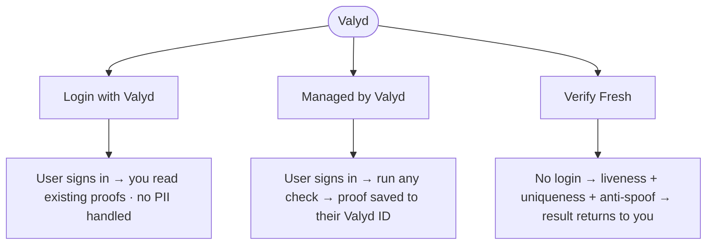

# Introduction

Valyd is a verified-identity platform. You can **verify your users**, or let people **sign in
with an identity they've already verified** — so you read proofs instead of re-collecting
documents.

**Three ways to integrate** — pick the one that fits what you're building:

- **Login with Valyd** — users sign in and **reuse the proofs they already hold**; you read
  verified status instead of collecting it again.
- **Managed by Valyd** — the signed-in user runs a hosted session where **every check** is
  available (ID/KYC, liveness, face match, age, license, uniqueness, location); passed proofs save
  to their Valyd ID and the raw identity data stays encrypted with Valyd.
- **Verify Fresh** — **no login, no account**; **liveness + face-uniqueness + anti-spoof** only,
  hosted or direct API, and the result returns to your system — nothing saved to an account.

## Choose your integration

| If you want to… | Use | Start here |
| --- | --- | --- |
| Sign the user in and run any check (ID/KYC, face match, age, license, location…) with proofs on their account | **Managed by Valyd** | [Managed by Valyd](/verifications/managed) |
| Run a one-off liveness / uniqueness check with no login, result back to you | **Verify Fresh** | [Verify Fresh](/verifications/standalone) |
| Let users sign in and reuse their verified identity | **Login with Valyd** | [Login with Valyd](/docs) |

Not sure which fits — or want the details on what each returns and who holds the data?
→ **[Choose your integration](/docs/choose)**

## Onboarding a workforce? Use an organization

If you're bringing a whole team or workforce onto Valyd — employees, staff, contractors — use an
**Organization**. Your people sign in with **Login with Valyd** (standard OIDC), and each active
member gets **unlimited verifications for $0.99 / month** (14-day free trial). Face login, no
passwords, and you always know exactly who signed in.

→ **[Organizations](/docs/organizations)** — how it works, roles, member onboarding, and pricing.

## Where everything lives

| Host | What it is |
| --- | --- |
| **`idp.valyd.work`** | The Valyd API — verification, the account APIs, and sign-in. Your app talks to this host. |
| **`dev.valyd.work`** | The **Developer Portal** — create apps, get your keys, and compose hosted flows. |
| **`docs.valyd.work`** | These docs, the [API Playground](/sandbox), and the [live demos](/demos). |

New accounts start with a **$100 credit** so you can build and [test](/docs/testing) for free.

## Concepts & terms

| Term | Meaning |
| --- | --- |
| **Valyd ID** | A person's verified identity: their face vector, verified legal name, and every proof they've earned. One per human. |
| `valyd_id` | The stable identifier of that identity — key your users on it. |
| **App** | What you register in the [Developer Portal](https://dev.valyd.work): the credentials your integration uses. |
| **Check** | One verification action (KYC, liveness, face match, license lookup). Returns one result. |
| **Workflow** | A saved bundle of checks the user completes in one [hosted](/verifications/hosted) session. |
| **Proof / badge** | The durable outcome of a passed check, saved on a Valyd account and reusable later. |
| **Scope** | What a user permits your app to read at login. [Managed per app](/docs/scopes). |
| **Organization** | A shared workspace: one team, shared apps, a workforce roster, one bill. [Details](/docs/organizations). |
| **Consent flow** | The explicit approval step for releasing raw identity data — separate from login. |
