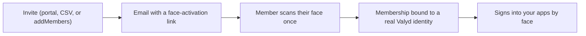

# Workforce onboarding

Bringing a whole team onto Valyd? The workforce onboarding flow turns each person into a
face-authenticated member of your organization — no passwords, and you always know exactly who
signed in. This page is the flow at a glance; the full API and lifecycle live in
[Members & onboarding](/docs/organizations/members).

## The flow

1. **Invite the member.** Add someone one at a time in the portal, by CSV upload, or over the
   [Organization API](/docs/organizations/api#add-members) (`addMembers()`). Each member gets a
   stable **member id `vmem_…`** — store it against your own employee record as your correlation
   key.
2. **They receive a face-activation link.** For a workforce member (`role: member`), Valyd emails a
   **face-activation link** by default. Prefer to deliver it yourself? Pass `notify: false` and read
   each created member's `activation_link` from the API response (returned for face invites only).
3. **They activate by face.** The member taps the link and scans their face once. That single scan
   **binds the membership to a real Valyd identity** — the moment this happens, the seat becomes
   `active` (the only billable state).
4. **They sign in by face from then on.** Members log into your apps with **Connect with Valyd**
   (standard OIDC) using face authentication — no passwords to manage or reset.

## Member status during onboarding

A membership moves through four states; watch for `active` to know onboarding finished:

| `status` | Meaning |
| --- | --- |
| `invited` | Created, no email sent yet (the `notify: false` path). |
| `link_sent` | Activation email sent, awaiting the person. |
| `active` | Face-activated and bound to a Valyd identity — billable. |
| `deactivated` | Removed from the workforce; app logins revoked, row kept. |

To know when someone finished, **poll** [`getMembers()`](/docs/organizations/api#list-members) and
watch for `status: "active"`, or re-send an expired invite with
[`resendMemberInvite(memberId)`](/docs/organizations/api#re-send-invite).

## Related

- [Members & onboarding](/docs/organizations/members) — the full member lifecycle, invite methods,
  deactivate/reactivate/remove, and recovery.
- [Organization API](/docs/organizations/api) — `addMembers()`, `getMembers()`, and the rest.
- [Roles](/docs/organizations/roles) — member vs admin vs developer, and what each invite path issues.
