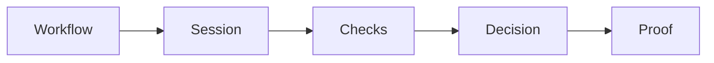

# Verification API

We verify people for you — KYC, liveness, face match, age, and professional licenses.

**The recommended way: verify into the user's Valyd account.** Have the user sign in with Valyd
and run any check with their token. The check pre-fills from their account, the passed proof is
saved to it, and from then on you **read verified status instead of handling identity data** —
the documents, selfies, and personal fields stay with Valyd, [encrypted under Valyd's data policies](/docs/data-and-trust#security-properties), not in your database. While the
proof is still fresh enough for your policy, there's no re-run and no new per-check cost.

**We also verify without any login.** Every check runs with just your App API key — the result
and the extracted identity fields are returned straight to your system. That flexibility comes
with a trade-off: **the user's personal information lands in your backend, and storing,
protecting, and deleting it becomes your responsibility.** Use this mode when you genuinely need
the raw result in your own records.

**Either way, we can do the heavy lifting:** with **Hosted**, you build one workflow out of
multiple checks and send the user to us — capture UI, camera handling, retries, and security are
ours; you get all the results together in one decision (webhook + decision endpoint).

> **Biometrics are irreversible vectors, never images.** Valyd does not store or return face
> images. Enrollment converts a selfie into a one-way biometric vector (template); every later
> face match compares vectors. The photos you submit to a check are processed transiently for
> that check and are not retrievable from a Valyd account. The template is never exposed through
> any API, and the KYC `portrait` field is extracted from the ID document you submitted in that
> request — not a stored account photo. [Full scoping →](/docs/data-and-trust)

## The mental model



- **[Workflow](/verifications/workflows)** — a reusable configuration describing which checks run in a hosted session.
- **[Session](/verifications/hosted)** — one user's run through a workflow on the hosted page (Core API calls run a single check without one).
- **[Checks](/verifications/types)** — the individual verifications: ID, liveness, face match, license, age, …
- **[Decision](/verifications/statuses)** — the authoritative combined outcome: `APPROVED` / `DECLINED` / `IN_REVIEW`.
- **[Proof](/verifications/managed)** — the durable outcome saved to a Valyd account when a check ran with the user's token; read it back via the [Account API](/docs/endpoints#resource-api--user-data).

## Pick one of these three journeys

| Journey | Valyd login? | Credential your backend uses | Result |
| --- | --- | --- | --- |
| One-off KYC or license verification | **No** | App API key | Result belongs to your integration; it is not added to a Valyd account |
| Hosted verification page | **No** | App API key + workflow | Redirect the user to Valyd; receive a signed webhook and fetch the decision |
| Verify and save to a Valyd account | **Yes, first** | App API key + user's OIDC access token | Successful proofs are linked to the user's account for future reuse |

## API-key-only checks

The simplest integration: your backend calls with `X-API-Key` — the person being checked never
signs in anywhere. The result and any extracted identity fields return to your system, and
storing and protecting that data is your responsibility.

You can:

- run ID/KYC verification;
- run liveness, anti-spoof, and face match;
- verify a professional license;
- run KYC plus license verification;
- use the hosted capture page or your own UI.

For a one-off professional-license lookup:

```bash
curl -X POST https://idp.valyd.work/api/v2/credential-verification \
  -H "X-API-Key: $VALYD_API_KEY" \
  -H "Content-Type: application/json" \
  -d '{
    "first_name": "Jane",
    "last_name": "Doe",
    "license_type": "MD",
    "license_state": "CA",
    "license_number": "A12345"
  }'
```

The result is returned to your system. Nothing is added to a Valyd user account.

## With login: verify and update the account

Use this only when the result should belong to a Valyd account:

1. Complete [Login with Valyd](/docs/quick-start).
2. Pass the signed-in user's `valyd_access_token` when creating the verification session or running
   an account-supported check.
3. Valyd uses existing account proofs when possible and saves newly completed proofs to the account.
4. Your app receives proofs; raw account attributes require explicit user consent.

Examples:

- verify a license and add the verified license badge to the user's account;
- complete KYC for an account that is not yet ID-verified;
- match a fresh selfie against the face already held by the user's account;
- read reusable verification proofs on a later login.

See [Account-connected verification](/verifications/managed).

## Hosted or direct API?

| Mode | Who builds the capture UI? | Result delivery | Best for |
| --- | --- | --- | --- |
| Hosted | Valyd | Signed webhook + decision endpoint | ID/selfie capture and quickest integration |
| Core API | You | Synchronous API response | License lookup, backoffice, batch, or custom UI |

## Data handling

- A one-off license check returns the registry verification result directly.
- A one-off KYC decision releases raw identity data only after the required ID, liveness, and
  face-match gates pass. Until then sensitive fields remain encrypted.
- Account-connected verification returns proofs, not raw account KYC.
- Webhooks are sent only to an active URL configured for your app and are signed.

Start with the [Verification API quickstart](/verifications/quickstart), then choose
[Hosted verification](/verifications/hosted) or [Core APIs](/verifications/standalone).
