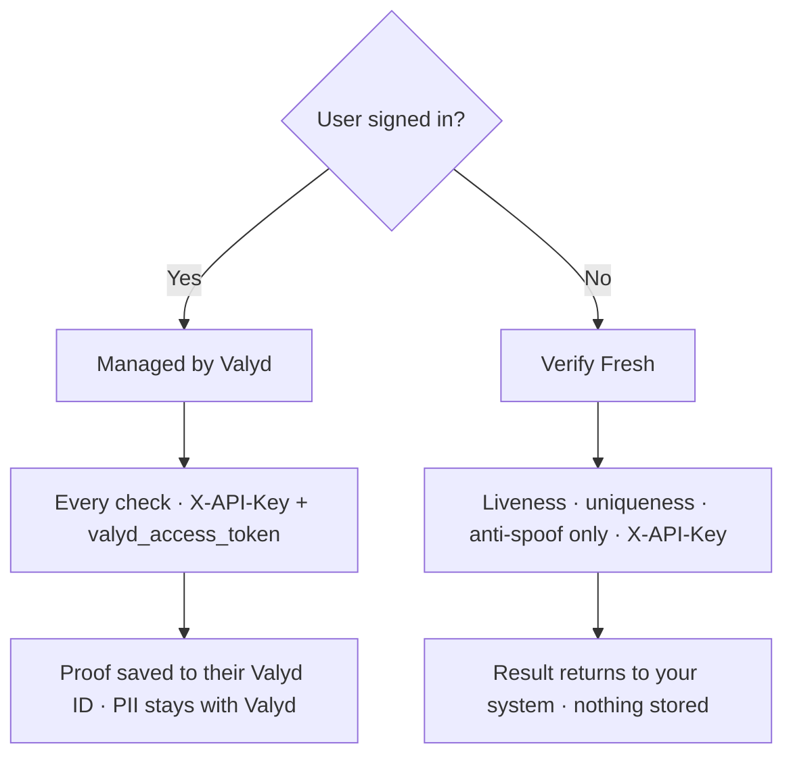

# Verification API

We verify people for you — KYC, liveness, face match, age, and professional licenses. **Two lanes,
both hosted** — the split is simply *is a user signed in?*

- **[Managed by Valyd](/verifications/managed)** — the signed-in user rides along as their
  `valyd_access_token` (your backend authenticates with the App API key, `X-API-Key`). **Every
  check** runs in one [hosted](/verifications/hosted) session, and passed proofs save to their
  Valyd ID. Documents, selfies, and personal fields stay
  [encrypted with Valyd](/docs/data-and-trust#security-properties), not in your database — so you
  **read verified status instead of handling identity data**.
- **[Verify Fresh](/verifications/standalone)** — the non-account lane: **no login**, only
  **liveness, anti-spoof, and face uniqueness**. Hosted page or direct API calls; the result
  returns to your system and nothing is saved to an account
  ([data-sharing model](/verifications/data-sharing)).

> **Biometrics are irreversible vectors, never images.** Valyd does not store or return face
> images. Enrollment converts a selfie into a one-way biometric vector (template); every later
> face match compares vectors. The photos you submit to a check are processed transiently for
> that check and are not retrievable from a Valyd account. The template is never exposed through
> any API, and the KYC `portrait` field is extracted from the ID document you submitted in that
> request — not a stored account photo. [Full scoping →](/docs/data-and-trust)

## The mental model

- **[Workflow](/verifications/workflows)** — a reusable configuration describing which checks run in a hosted session.
- **[Session](/verifications/hosted)** — one user's run through a workflow on the hosted page (a Verify Fresh direct call runs a single liveness / uniqueness check without one).
- **[Checks](/verifications/types)** — the individual verifications: ID, liveness, face match, license, age, …
- **[Decision](/verifications/statuses)** — the authoritative combined outcome: `APPROVED` / `DECLINED` / `IN_REVIEW`.
- **[Proof](/verifications/managed)** — the durable outcome saved to the user's Valyd ID when a check ran with their token; read it back via the [Account API](/docs/endpoints#resource-api--user-data).

## The user's journey, start to finish

1. **[Sign the user in](/docs)** — one button; your backend receives their `valyd_access_token`.
2. **Read what they already have** — profile, `id_verified`, verified licenses, badges, and age
   bands via the [Account API](/docs/endpoints#resource-api--user-data). If the proof you need is
   already there and fresh, you're done — no check, no cost.
3. **Something missing? Run the check for them** — create a
   [Managed by Valyd](/verifications/managed) hosted session with the user's token. A returning
   user re-verifies with a **selfie only** (matched against their stored face vector);
   already-verified KYC and licenses are skipped.
4. **The proof lands on their Valyd ID** — next time, step 2 answers instead of step 3.

[Verify the user](/verifications/managed) walks this end to end.

## Data handling

- **Managed by Valyd** checks run with the user's token and return **proofs, not raw account KYC**
  — raw attributes require the user's explicit [consent](/docs/request-data), and the raw identity
  data stays encrypted with Valyd.
- **Verify Fresh** (tokenless) runs only liveness, anti-spoof, and face uniqueness — there is no
  ID/KYC or document data to release; the check result returns to your system.
- Webhooks are sent only to an active URL configured for your app and are signed.
- Verify Fresh direct checks return results to your system — see
  [Data sharing](/verifications/data-sharing) for what that means for you.

Start with [Setup](/verifications/setup) and the
[quickstart](/verifications/quickstart), then wire up
[hosted delivery](/verifications/hosted) or browse the
[check types](/verifications/types).
