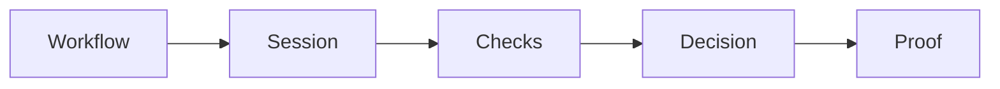

# Verification API

We verify people for you — KYC, liveness, face match, age, and professional licenses.

**The story is the user's.** They sign in with Valyd, your app reads what their identity already
holds — KYC done? verified licenses? badges and proofs? — and when something is missing you run
the check *for them*: the same APIs, delivered either on a Valyd-hosted capture page or as a
direct API call from your backend. Your backend authenticates with the App API key (`X-API-Key`);
the signed-in user rides along as their `valyd_access_token`, so the passed proof lands on their
Valyd ID. From then on you **read verified status instead of handling identity data** — documents,
selfies, and personal fields stay with Valyd, [encrypted under Valyd's data policies](/docs/data-and-trust#security-properties),
not in your database. While a proof is still fresh enough for your policy, there's no re-run and
no new per-check cost.

**Hosted or non-hosted, it's the same API.** With [Hosted](/verifications/hosted) you compose a
workflow of checks and send the user to us — capture UI, camera handling, retries, and security
are ours; you get one combined decision (webhook + decision endpoint). Calling the endpoints
directly from your own UI runs the very same checks one at a time.

Running checks on your own data, with no user in the loop? That's the
[standalone product](/verifications/standalone) — a separate, self-contained integration with its
own [data-sharing model](/verifications/data-sharing).

> **Biometrics are irreversible vectors, never images.** Valyd does not store or return face
> images. Enrollment converts a selfie into a one-way biometric vector (template); every later
> face match compares vectors. The photos you submit to a check are processed transiently for
> that check and are not retrievable from a Valyd account. The template is never exposed through
> any API, and the KYC `portrait` field is extracted from the ID document you submitted in that
> request — not a stored account photo. [Full scoping →](/docs/data-and-trust)

## The mental model

- **[Workflow](/verifications/workflows)** — a reusable configuration describing which checks run in a hosted session.
- **[Session](/verifications/hosted)** — one user's run through a workflow on the hosted page (direct API calls run a single check without one).
- **[Checks](/verifications/types)** — the individual verifications: ID, liveness, face match, license, age, …
- **[Decision](/verifications/statuses)** — the authoritative combined outcome: `APPROVED` / `DECLINED` / `IN_REVIEW`.
- **[Proof](/verifications/managed)** — the durable outcome saved to the user's Valyd ID when a check ran with their token; read it back via the [Account API](/docs/endpoints#resource-api--user-data).

## The user's journey, start to finish

1. **[Sign the user in](/docs)** — one button; your backend receives their `valyd_access_token`.
2. **Read what they already have** — profile, `id_verified`, verified licenses, badges, and age
   bands via the [Account API](/docs/endpoints#resource-api--user-data). If the proof you need is
   already there and fresh, you're done — no check, no cost.
3. **Something missing? Run the check for them** — create a
   [hosted session](/verifications/hosted) or call the endpoint directly, passing the user's
   token. A returning user re-verifies with a **selfie only** (matched against their stored face
   vector); already-verified KYC and licenses are skipped.
4. **The proof lands on their Valyd ID** — next time, step 2 answers instead of step 3.

[Verify the user](/verifications/managed) walks this end to end.

## Data handling

- Checks run with the user's token return **proofs, not raw account KYC** — raw attributes
  require the user's explicit [consent](/docs/request-data).
- On standalone (tokenless) hosted runs, raw identity data is released to you only after the
  required ID, liveness, and face-match gates pass; token runs never release it — you get
  proofs and public data.
- Webhooks are sent only to an active URL configured for your app and are signed.
- Direct API checks return results to your system — see
  [Data sharing](/verifications/data-sharing) for what that means for you.

Start with [Setup](/verifications/setup) and the
[quickstart](/verifications/quickstart), then wire up
[hosted delivery](/verifications/hosted) or browse the
[check types](/verifications/types).
