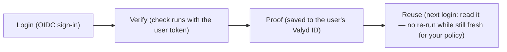

# Verify & save a proof

> 🔑 **Auth:** App API key + the user's `valyd_access_token` · 💾 **Result:** the proof saves to the user's Valyd ID

Everything the user's token unlocks — reads and checks — lives on
[one page](/docs/user-token); this page is the check reference.

The user is signed in — now run any check for them. Pass their `valyd_access_token` alongside
your App API key and the check pre-fills from their account, skips what's already proven, and
saves the passed proof back to their Valyd ID:



**What is a proof?** The durable outcome of a passed check saved on the user's Valyd account — a
pseudonym, `id_verified`, verified license badges, age bands — read back any time via the
[Account API](/docs/endpoints#resource-api--user-data) or `GET /api/v2/identity`. The account's
`identity` object carries a `verified_at` timestamp so you can judge freshness; a license badge
carries the registry's own `status` and `expires_at`. Re-run a check when your policy needs a
fresher answer.

Check first, run second:

1. **Read the account** — [Account API](/docs/endpoints#resource-api--user-data): is KYC done?
   Which licenses are already verified? If the proof is there and fresh, stop here.
2. **Run what's missing with the user's token** — hosted session or direct call; the passed
   proof saves to their Valyd ID.

Because the verified identity lives on the user's Valyd ID, it is **reused** everywhere: a
returning user re-verifies with a **selfie only** (matched against their stored face vector), and
already-verified KYC and licenses are skipped.

## Data-sharing rule (critical)

- **Account APIs return proofs only** — a pseudonym, `id_verified`, verified license badges, and age
  bands. They **never** return raw KYC (legal name, date of birth, document images). In a decision,
  the `id_verification` check reduces to `{ status, id_verified }`; `identity` is
  `{ valyd_id, pseudonym, id_verified, age_bands, licenses, verified_at }`.
- **Raw account KYC is released only through the consent API** — you request specific attributes,
  the user approves in their Valyd app, and the values are returned end-to-end encrypted (X25519 sealed
  box) to your public key. See "Consent API" below.

## Hosted flow (recommended)

1. Register your app at the Developer Portal (https://dev.valyd.work) → `client_id` / `client_secret`, and set up its verification capability in the same portal (surfaced there as a Verify "project") → API key (`vrf_…`, shown once) + `workflow_id`. One console, all credentials.
2. Log the user in with Valyd (OAuth2/OIDC), exchange the code → `valyd_access_token` + identity.
3. If KYC is required and not done, **redirect the user to Valyd** to complete it (raw KYC is stored
   under the user's per-user key; it can't be a plain API write — account KYC is hosted-only).
4. Create a session: `POST https://idp.valyd.work/api/v2/session` with `workflow_id`, `valyd_access_token`,
   `vendor_data`, and (for redirect) `redirect_url` + `callback`.
5. Redirect the user to the returned hosted `url`. Reuse skips already-completed steps.
6. Read the result via the signed webhook and/or `GET /api/v2/session/{id}/decision` — **proofs only**
   (`origin: "managed"`).

The SDK form of step 4 — one call, the user's token ties the flow to their identity:

```typescript
const session = await verify.sessions.create({
  workflowId,                      // the checks you picked in the portal
  valydAccessToken: accessToken,   // ← ties the run to the signed-in user
  redirectUrl: "https://yourapp.com/verified",
});
// → send them to session.url — proofs come back, PII doesn't
```

## Direct API calls (same checks, your UI)

- **License / credential**: matched against the account's real name, the verified badge is stored on the
  account, and a proof is returned.
- **Face match**: a selfie is matched against the account's stored face vector (only the selfie leaves
  your server).
- **Liveness**: confirms the selfie is a live person, not a photo or replay — runs with the token,
  the assurance rides on the same account.
- **Reuse read / revoke**: `GET /api/v2/identity?valyd_id=…` (proofs only) and
  `DELETE /api/v2/identity/{valyd_id}`.
- **KYC**: redirect the user to Valyd (raw KYC needs the per-user encryption key to store —
  hosted-only).

## Consent API — request raw KYC (user approves)

There are **two ways** to get raw account attributes (full guide: `/docs/request-data`):

- **Any time after login (use this today)** — the `attribute-request` flow below; the user approves
  in their Valyd app (notification → face approval). This is the supported path.
- **At login** *(currently disabled — the consent screen is login-only right now)* — when enabled,
  add `attributes` + your X25519 `requester_public_key` to the authorize URL and the granted fields
  ride back with the login as `attr_code`.

After login, request explicitly:

```bash
# 1) Request specific attributes, sending your X25519 public key
curl -X POST https://idp.valyd.work/api/auth/attribute-request \
  -H "Authorization: Bearer $CLIENT_TOKEN" -H "Content-Type: application/json" \
  -d '{ "client_id": "$CLIENT_ID",
        "attributes": ["legal_name","dob","id_verified"],
        "requester_public_key": "<base64 X25519 pubkey>" }'
# → { data: { request_id, status: "pending" } }

# 2) The USER approves in their Valyd app. Then:
curl https://idp.valyd.work/api/auth/attribute-request/<request_id>/result \
  -H "Authorization: Bearer $CLIENT_TOKEN"
# → { data: { status: "approved", sealed_box: "<base64>" } }  # decrypt with your X25519 private key
```

A second consent surface, `credential-share`, releases a specific vault credential and gates the release
with a face scan as the user's consent.

---

Verifying data you hold yourself, with no user in the loop? See
[Standalone checks](/verifications/standalone).
