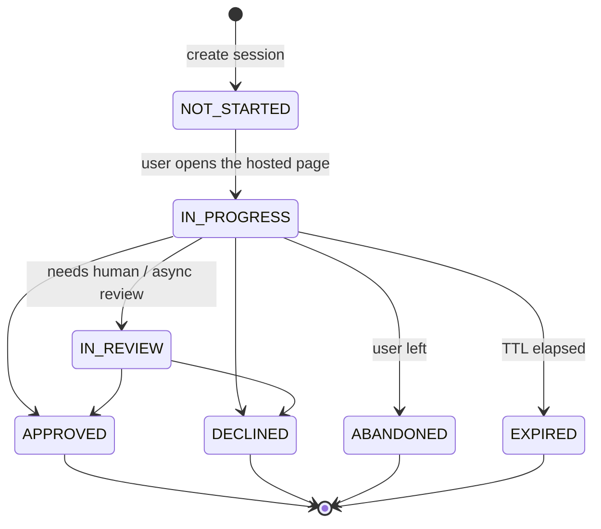

# Session lifecycle

A hosted verification session is one person's single run through a
[workflow](/verifications/workflows)'s checks. It moves through a small state machine that always
ends in a terminal decision. This page is the lifecycle over time; the exact status values and how
to act on each live in [Decisions & statuses](/verifications/statuses), and the end-to-end
integration is in [Hosted verification](/verifications/hosted).

## The states over time



1. **Created (`NOT_STARTED`).** Your backend calls `POST /api/v2/session` with a `workflow_id`. The
   response carries the hosted `url`, a `session_token`, and `expires_at`. Tag it with `vendor_data`
   (your internal user ref, echoed back on the webhook) and bound its lifetime with `ttl_seconds`.
2. **In progress (`IN_PROGRESS` → optionally `IN_REVIEW`).** The user opens the hosted `url` and
   completes the workflow's checks. A session that needs manual or async review passes through
   `IN_REVIEW` first; otherwise it goes straight to a terminal state.
3. **Terminal decision (`APPROVED` · `DECLINED` · `ABANDONED` · `EXPIRED`).** The lifecycle ends.
   Terminal is terminal: an abandoned or expired session is **never** resumed — create a new one.

## Two signals, one authority

When the user finishes, Valyd sends two things — treat only one as authoritative:

- **The redirect `?status=` is a hint.** The user's browser returns to your `redirect_url` with
  `?session_id=…&status=…`. Never grant access on that query param — it is a UI hint only.
- **The decision API is authoritative.** Read the real outcome from
  `GET /api/v2/session/{id}/decision`, which carries the session status plus the per-check
  breakdown. See [Hosted verification, step 4](/verifications/hosted).
- **A signed webhook fires on the terminal state.** Valyd POSTs to your `callback` with the event
  and decision. The webhook is a notification — still call the decision API for the full per-check
  detail. See [Webhooks](/verifications/webhooks).

## What to do at each stage

```text
IF status is NOT_STARTED or IN_PROGRESS:  → wait; the run is not finished. Keep the session pending.
IF status is IN_REVIEW:                    → wait for the review outcome; do not grant access yet.
IF status is APPROVED:                     → fetch the decision, then grant access / complete onboarding.
IF status is DECLINED:                     → fetch the decision to see which checks failed; deny and offer a retry if your policy allows.
IF status is ABANDONED or EXPIRED:         → treat as not verified; create a new session if the user still needs to verify.
```

## Related

- [Decisions & statuses](/verifications/statuses) — every status value and the per-check statuses.
- [Hosted verification](/verifications/hosted) — creating the session and reading the decision.
- [Webhooks](/verifications/webhooks) — the signed terminal-state notification.
