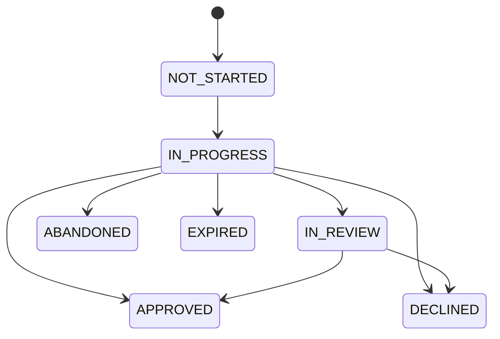

# Decisions & statuses

**The decision is the authoritative outcome — never trust redirect query params as final.** The
`?status=` your `redirect_url` receives is a hint only; confirm every result via the signed
[webhook](/verifications/webhooks) or `GET /api/v2/session/{id}/decision`
([hosted flow, step 4](/verifications/hosted)).

## Session status

Lifecycle transitions:



`IN_REVIEW` is optional: a session may go directly from `IN_PROGRESS` to a terminal state, or pass through `IN_REVIEW` first.

| Status        | Meaning                                              |
|---------------|------------------------------------------------------|
| `NOT_STARTED` | Session created, user not yet on the hosted page     |
| `IN_PROGRESS` | User is interacting with the flow                    |
| `IN_REVIEW`   | Awaiting human / async review                        |
| `APPROVED`    | All checks passed (or manually approved)             |
| `DECLINED`    | Checks failed (or manually declined)                 |
| `ABANDONED`   | User left before completing                          |
| `EXPIRED`     | TTL elapsed before completion                        |

Terminal states (a webhook is sent and the lifecycle ends): `APPROVED`, `DECLINED`, `ABANDONED`, `EXPIRED`.
Non-terminal states (still in flight): `NOT_STARTED`, `IN_PROGRESS`, `IN_REVIEW`.

**Unknown values:** new statuses may be added over time ([versioning](/verifications/versioning)) —
treat unknown verification states as **not approved** until your application explicitly supports
them.

### Manual review decisions

An `IN_REVIEW` session can be resolved by a reviewer on your side via
`PATCH /api/v2/session/{id}/status` with `{ "status": "APPROVED" | "DECLINED" }`
([reference](/verifications/api-reference#patch-apiv2sessionidstatus--manual-override)). This
records your **business decision** on the session — it does not change what the individual checks
proved; the per-check results are preserved in the decision. Only `IN_REVIEW` sessions can be
manually decided, and a manual `APPROVED` still requires the session's ID verification, liveness,
and face-match checks to have passed.

### Decision tree — how to act on a session status

```text
IF status == NOT_STARTED:   → do nothing yet; wait for the user to open the hosted page. Keep the session pending.
IF status == IN_PROGRESS:   → do nothing yet; the user is mid-flow. Keep the session pending.
IF status == IN_REVIEW:     → do nothing yet; await the review outcome. The session will move to APPROVED or DECLINED. Do not grant access.
IF status == APPROVED:      → fetch GET /api/v2/session/{id}/decision for the full extracted data, then grant access / complete onboarding.
IF status == DECLINED:      → fetch GET /api/v2/session/{id}/decision to see which checks failed; deny access and surface a retry path if your policy allows.
IF status == ABANDONED:     → treat as not verified; prompt the user to restart verification (create a new session).
IF status == EXPIRED:       → treat as not verified; the session TTL elapsed. Create a new session if the user still needs to verify.
IF unsure of current state: → run `curl https://idp.valyd.work/api/v2/session/{id} -H "X-API-Key: $VALYD_API_KEY"` to read the current status.
```

## Check status

Each individual check within a session reports one of three values:

| Check status | Meaning                                  |
|--------------|------------------------------------------|
| `passed`     | check succeeded                          |
| `failed`     | check failed                             |
| `review`     | inconclusive; needs human or async review|

### Decision tree — how to act on a check status

```text
IF check == passed: → this check is satisfied. If all checks are passed, the session moves toward APPROVED.
IF check == failed: → this check did not succeed. It typically drives the session toward DECLINED; inspect the decision for the failure reason.
IF check == review: → inconclusive. The session typically sits in IN_REVIEW until a human or async process resolves it. Do not grant access on this check yet.
IF unsure:          → run `curl https://idp.valyd.work/api/v2/session/{id}/decision -H "X-API-Key: $VALYD_API_KEY"` to read per-check statuses.
```

Relationship between check status and session status:
- All checks `passed` → session typically `APPROVED`.
- Any check `failed` → session typically `DECLINED`.
- Any check `review` (and none failed) → session typically `IN_REVIEW` until resolved.
