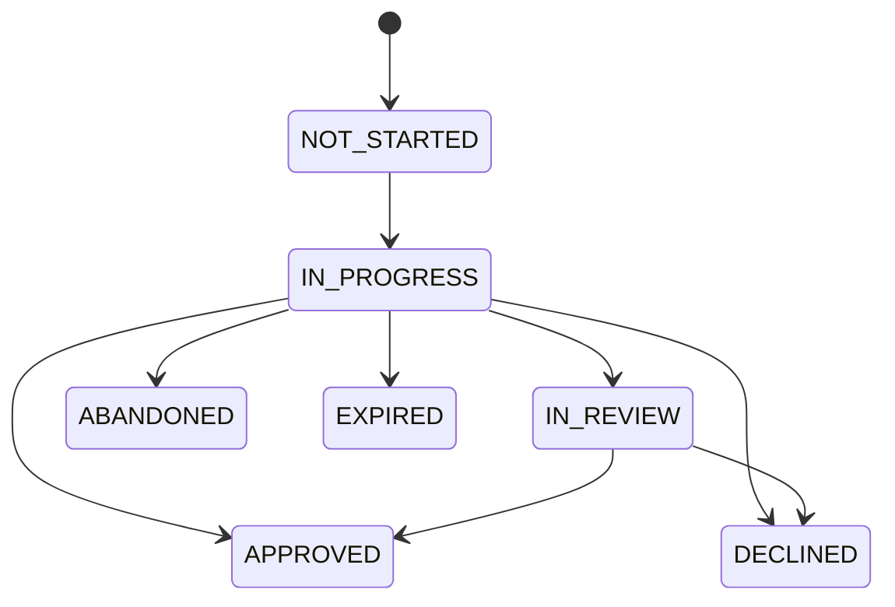

# Results & decisions

**The decision is the authoritative outcome — never trust redirect query params as final.** The
`?status=` your `redirect_url` receives is a hint only; confirm every result via the signed
[webhook](/verifications/webhooks) or `verify.sessions.decision(id)`
([Run a verification, step 4](/verifications/quickstart)).

## Session status

Lifecycle transitions:



`IN_REVIEW` is optional: a session may go directly from `IN_PROGRESS` to a terminal state, or pass through `IN_REVIEW` first.

| Status        | Meaning                                              |
|---------------|------------------------------------------------------|
| `NOT_STARTED` | Session created, user not yet on the verification page     |
| `IN_PROGRESS` | User is interacting with the flow                    |
| `IN_REVIEW`   | Awaiting human / async review                        |
| `APPROVED`    | All checks passed (or manually approved)             |
| `DECLINED`    | Checks failed (or manually declined)                 |
| `ABANDONED`   | User left before completing                          |
| `EXPIRED`     | TTL elapsed before completion                        |

Terminal states (a webhook is sent and the lifecycle ends): `APPROVED`, `DECLINED`, `ABANDONED`, `EXPIRED`.
Non-terminal states (still in flight): `NOT_STARTED`, `IN_PROGRESS`, `IN_REVIEW`.

**Unknown values:** new statuses may be added over time ([versioning](/verifications/versioning)) —
treat unknown verification states as **not approved** until your application explicitly supports
them.

### Manual review decisions

An `IN_REVIEW` session can be resolved by a reviewer on your side via
`verify.sessions.updateStatus(id, "APPROVED" | "DECLINED")`. This
records your **business decision** on the session — it does not change what the individual checks
proved; the per-check results are preserved in the decision. Only `IN_REVIEW` sessions can be
manually decided, and a manual `APPROVED` still requires the session's ID verification, liveness,
and face-match checks to have passed.

### Decision tree — how to act on a session status

```text
IF status == NOT_STARTED:   → do nothing yet; wait for the user to open the verification page. Keep the session pending.
IF status == IN_PROGRESS:   → do nothing yet; the user is mid-flow. Keep the session pending.
IF status == IN_REVIEW:     → do nothing yet; await the review outcome. The session will move to APPROVED or DECLINED. Do not grant access.
IF status == APPROVED:      → call verify.sessions.decision(id) for the full extracted data, then grant access / complete onboarding.
IF status == DECLINED:      → call verify.sessions.decision(id) to see which checks failed; deny access and surface a retry path if your policy allows.
IF status == ABANDONED:     → treat as not verified; prompt the user to restart verification (create a new session).
IF status == EXPIRED:       → treat as not verified; the session TTL elapsed. Create a new session if the user still needs to verify.
IF unsure of current state: → call verify.sessions.retrieve(id) to read the current status.
```

## Check status

Each individual check within a session reports one of three values:

| Check status | Meaning                                  |
|--------------|------------------------------------------|
| `passed`     | check succeeded                          |
| `failed`     | check failed                             |
| `review`     | inconclusive; needs human or async review|

### Decision tree — how to act on a check status

```text
IF check == passed: → this check is satisfied. If all checks are passed, the session moves toward APPROVED.
IF check == failed: → this check did not succeed. It typically drives the session toward DECLINED; inspect the decision for the failure reason.
IF check == review: → inconclusive. The session typically sits in IN_REVIEW until a human or async process resolves it. Do not grant access on this check yet.
IF unsure:          → call verify.sessions.decision(id) to read per-check statuses.
```

Relationship between check status and session status:
- All checks `passed` → session typically `APPROVED`.
- Any check `failed` → session typically `DECLINED`.
- Any check `review` (and none failed) → session typically `IN_REVIEW` until resolved.

## Reading the decision

The webhook is a notification; the **decision call** holds the authoritative result and the
full per-check breakdown. Pull it with `verify.sessions.decision(id)`
([Run a verification](/verifications/quickstart); [webhooks](/verifications/webhooks)):

```text
IF you received a webhook:               → it carries event.status and event.decision; still call verify.sessions.decision(id) for the full check breakdown.
IF you want to pull the result yourself: → call verify.sessions.decision(sessionId).

Then read d.status:
  IF d.status == "APPROVED":   → verification succeeded (see the per-check rule below for KYC + License).
  IF d.status == "DECLINED":   → verification failed; inspect d.checks for the failing check's error.
  IF d.status == "IN_REVIEW":  → a human/manual review is pending; wait for a terminal webhook or poll again.

Per check in d.checks (each: { type, status, score, data, error }):
  IF check.status == "passed":  → this check succeeded.
  IF check.status == "failed":  → read check.error?.message (e.g. "License belongs to a different name").
  IF check.status == "review":  → this check is awaiting manual review.
  IF check.status == "pending" or "running": → not finished yet.
```

```javascript
const d = await verify.sessions.decision(sessionId);

// d.status   → session progress: "APPROVED" | "DECLINED" | "IN_REVIEW" (may still be pending)
// d.decision → final business outcome, resolved only: "APPROVED" | "DECLINED" (never IN_REVIEW)
// d.checks     → [{ type, status, score, data, error }]
// d.decided_at → ISO timestamp

const credential = d.checks.find(c => c.type === "credential");
if (credential.status === "failed") {
  console.log(credential.error?.message);
  // e.g. "License belongs to a different name"
}
```

**Mode note:** the decision below illustrates a [Reusable Verification](/verifications)
session (created **with** a `valyd_access_token`). With the user's token the decision carries what
passed, proofs, and public data — the raw PII stays encrypted on their account and never reaches
your server.

```json
{
  "status":   "APPROVED",
  "decision": "APPROVED",
  "decided_at": "2026-06-11T12:05:00Z",
  "checks": [
    { "type": "id_verification", "status": "passed", "score": 0.97, "data": { /* fields, portrait, … */ } },
    { "type": "liveness",        "status": "passed", "score": 1.00, "data": { "live_score": 1 } },
    { "type": "face_match",      "status": "passed", "score": 0.97, "data": { "similarity": 0.97, "threshold": 0.95 } },
    { "type": "credential",      "status": "passed", "score": 1.00,
      "data": { "match": true, "license": { "status": "active", "expires_at": "2027-01-01" } } }
  ]
}
```

APPROVED for KYC + License means ALL of:
- The ID was verified (OCR + authenticity).
- The selfie was live.
- The selfie matches the ID portrait.
- The license exists AND belongs to the person on the ID.
