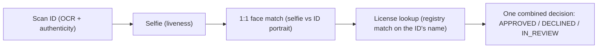

# Workflows

> 🔑 **Auth:** App API key (`X-API-Key`) · 🧩 **Used by:** hosted sessions (`workflow_id`)

A **workflow** is a reusable configuration describing which checks run in a hosted session. You
define it once — in the Developer Portal or via the API — and reference its `workflow_id` every
time you create a session. The hosted page auto-adapts its steps to the workflow's checks, and all
results come back together in one decision.

## Example: the "KYC + License" workflow

The workflow's `features` are `[id_verification, liveness, face_match, credential]`, and a user's
hosted session walks the chain:



Because the license is matched against the name OCR'd from the verified ID, the user never types a
name and cannot present someone else's license.


## Creating a workflow

**In the Developer Portal** (https://dev.valyd.work) → **Workflows**: create a workflow from a
preset, then copy its `workflow_id`. There are two presets, and both use the **same integration
code** — only the `workflow_id` differs:

#### License Verification — *Credential only*
- Checks: `[credential]`
- Hosted flow: State → license type → name + license number → verify.
- Fastest path to verify a professional license. No ID scan required.

#### KYC + License — *Identity + Credential*
- Checks: `[id_verification, liveness, face_match, credential]`
- Hosted flow: Scan ID + selfie (OCR + liveness + 1:1 face match), then state + license type + license number.
- The name is taken from the verified ID automatically (the user doesn't type it), so a license belonging to a different person is rejected.

```text
IF you only need to verify a professional license (no ID scan):  → use the "License Verification" workflow_id
IF you need identity + credential (ID scan + selfie + license):  → use the "KYC + License" workflow_id
IF unsure which workflow_id to use:                              → open the Developer Portal (https://dev.valyd.work) → Workflows, and copy the workflow_id of the preset you created
```

**Via the API:**

```bash
curl -X POST https://idp.valyd.work/api/v2/workflows \
  -H "X-API-Key: $VALYD_API_KEY" \
  -H "Content-Type: application/json" \
  -d '{ "name": "KYC + License", "features": ["id_verification","liveness","face_match","credential"] }'
# → { "success": true, "data": { "id": "wf_…", … } } — use data.id as your workflow_id
```

Full REST CRUD lives at `POST / GET / PATCH / DELETE /api/v2/workflows[/{id}]` (auth `X-API-Key`).
The Node SDK does **not** expose workflow CRUD — compose in the Portal or call these endpoints
directly, then pass the resulting `workflow_id` to `verify.sessions.create({ workflowId, … })`.

## Using the workflow ID

Pass the `workflow_id` when creating a hosted session:

```bash
curl -X POST https://idp.valyd.work/api/v2/session \
  -H "X-API-Key: $VALYD_API_KEY" \
  -H "Content-Type: application/json" \
  -d '{ "workflow_id": "wf_…", "redirect_url": "https://app.example.com/verify/callback" }'
```

The session's `features` array in the response echoes the workflow's checks. Both hosted products
use the **same integration code** — only the `workflow_id` differs, so switching from
license-only to full KYC + license is a one-variable change.

## Example: bundling several checks in one session

One hosted session can run **several checks back to back** — the person completes them all on one
page, and you get **one combined decision**. A common shape is an **EVV / home-health** onboarding
where a caregiver must, in a single sitting, prove **who they are, that they're licensed, and where
they are**:

- **ID / KYC** — scan a government ID (OCR + authenticity) with a **live** selfie and 1:1 face match.
- **Professional license** — verify their nursing/clinical license against the name on the ID.
- **Location verification** — confirm they're at the visit location.

You don't wire these together in code. In the workflow builder you pick the checks (and their
order) once, and Valyd hands you a single `workflow_id`. Then the **same one call** you already use
runs the whole flow — the person selects nothing technical, they just complete each step in turn:

```javascript
// The workflow already bundles [id_verification, liveness, face_match, credential, location].
const session = await verify.sessions.create({
  workflowId:  process.env.VALYD_EVV_WORKFLOW_ID, // the EVV workflow you built in the portal
  redirectUrl: `${process.env.APP_URL}/visits/verified`,
  callback:    `${process.env.APP_URL}/webhooks/valyd`,
  vendorData:  visit.caregiverId,   // your internal ref — echoed back on the webhook
});
// → res.redirect(session.url)  — one page, ID → license → location, in order
```

```bash
curl -X POST https://idp.valyd.work/api/v2/session \
  -H "X-API-Key: $VALYD_API_KEY" \
  -H "Content-Type: application/json" \
  -d '{
    "workflow_id":  "wf_evv_…",
    "redirect_url": "https://app.example.com/visits/verified",
    "callback":     "https://api.example.com/webhooks/valyd",
    "vendor_data":  "caregiver_123"
  }'
```

When the caregiver finishes, one signed webhook fires with **one decision** covering every check,
and the decision's `checks` array carries the per-check breakdown (ID, liveness, face match,
license, location) — read it as in [Decisions & statuses](/verifications/statuses).

## Changing a workflow

Update a workflow's name or features in the portal or via `PATCH /api/v2/workflows/{id}`. A session runs
the checks of the workflow it was created with — create a new session to pick up changes. Keep
separate workflows (and apps) for test and production rather than mutating one in place.

## Reuse on account-connected sessions

When a session is created with a signed-in user's `valyd_access_token`
([reusable identity](/verifications/managed)), the hosted flow **skips steps the account has
already completed** — an already-KYC'd user isn't asked to rescan their ID; a returning user
re-verifies with a selfie matched against their stored face vector. Standalone sessions (no
token) always run every check in the workflow.

Next: [Hosted verification](/verifications/hosted) for the full session lifecycle, or
[Verification types](/verifications/types) for what each check does.
