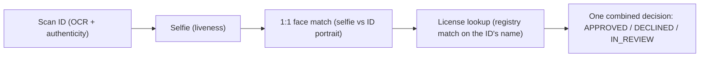

# Workflows

> 🔑 **Auth:** App API key (`X-API-Key`) · 🧩 **Used by:** hosted sessions (`workflow_id`)

A **workflow** is a reusable configuration describing which checks run in a hosted session. You
define it once — in the Developer Portal or via the API — and reference its `workflow_id` every
time you create a session. The hosted page auto-adapts its steps to the workflow's checks, and all
results come back together in one decision.

## Example: the "KYC + License" workflow

The workflow's `features` are `[id_verification, liveness, face_match, credential]`, and a user's
hosted session walks the chain:



Because the license is matched against the name OCR'd from the verified ID, the user never types a
name and cannot present someone else's license.


## Creating a workflow

**In the Developer Portal** (https://dev.valyd.work) → **Workflows**: create a workflow from a
preset — "License Verification" (checks: `[credential]`) or "KYC + License"
(`[id_verification, liveness, face_match, credential]`) — then copy its `workflow_id`.

**Via the API / SDK:**

```javascript
const wf = await verify.workflows.create({
  name: "KYC + License",
  features: ["id_verification", "liveness", "face_match", "credential"],
});
// wf.id → use as workflow_id when creating sessions
```

`verify.workflows.list()`, `.retrieve(id)`, `.update(id, {...})`, and `.remove(id)` round out the
CRUD (↔ `/api/v2/workflows`, auth `X-API-Key`).

## Using the workflow ID

Pass the `workflow_id` when creating a hosted session:

```bash
curl -X POST https://idp.valyd.work/api/v2/session \
  -H "X-API-Key: $VALYD_API_KEY" \
  -H "Content-Type: application/json" \
  -d '{ "workflow_id": "wf_…", "redirect_url": "https://app.example.com/verify/callback" }'
```

The session's `features` array in the response echoes the workflow's checks. Both hosted products
use the **same integration code** — only the `workflow_id` differs, so switching from
license-only to full KYC + license is a one-variable change.

## Changing a workflow

Update a workflow's name or features in the portal or with `workflows.update()`. A session runs
the checks of the workflow it was created with — create a new session to pick up changes. Keep
separate workflows (and apps) for test and production rather than mutating one in place.

## Reuse on account-connected sessions

When a session is created with a signed-in user's `valyd_access_token`
([reusable identity](/verifications/managed)), the hosted flow **skips steps the account has
already completed** — an already-KYC'd user isn't asked to rescan their ID; a returning user
re-verifies with a selfie matched against their stored face vector. Standalone sessions (no
token) always run every check in the workflow.

Next: [Hosted verification](/verifications/hosted) for the full session lifecycle, or
[Verification types](/verifications/types) for what each check does.
